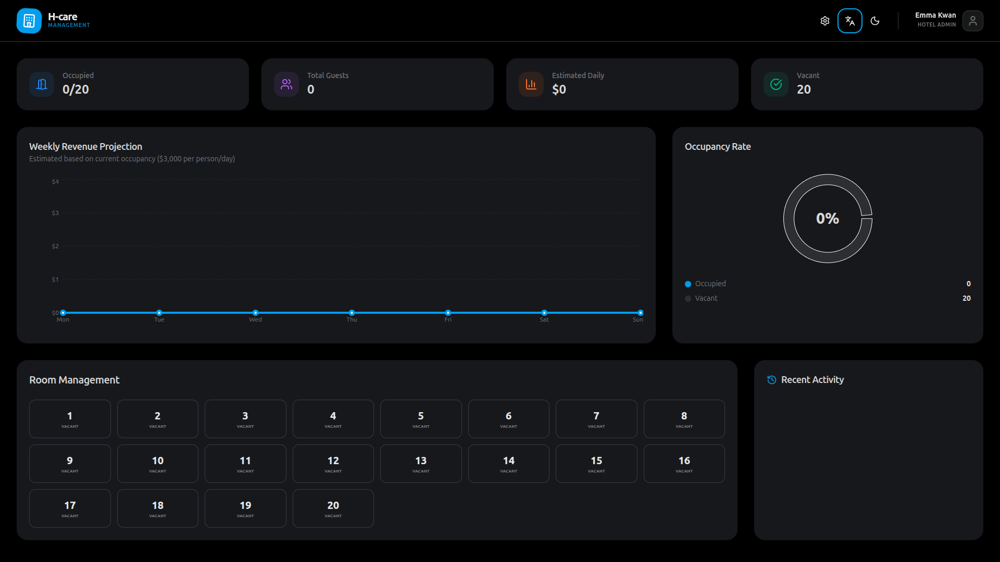
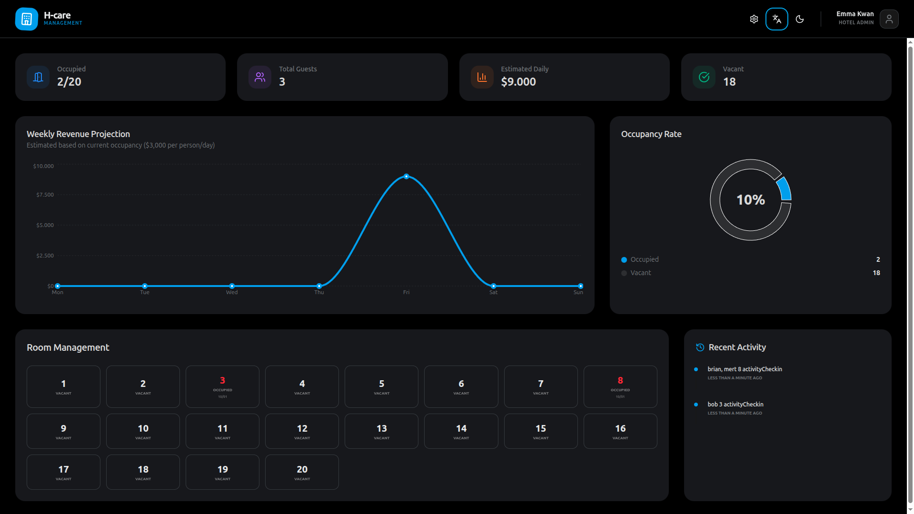

# 🏨 Modern Hotel Management Dashboard

H-care, otel yöneticileri için tasarlanmış profesyonel, kullanıcı dostu ve modern bir yönetim panelidir. React, Vite, Tailwind CSS ve Shadcn/UI kullanılarak geliştirilen bu uygulama, gerçek zamanlı oda takibi ve gelir analizi sunar.

#<div align="center">
  
  
  
</div> <!-- Buraya ileride ekran görüntüsü linkini ekleyebilirsiniz -->

## ✨ Özellikler

- **🏷️ Akıllı Oda Yönetimi:** Odaların doluluk durumunu anlık takip edin, yeni kayıtlar oluşturun.
- **💰 Gelir Analizi:** Günlük ve haftalık gelir projeksiyonlarını interaktif grafiklerle izleyin.
- **⏳ Gecikme Uyarıları:** Çıkış saati geçen misafirler için otomatik kırmızı alarm ve uyarı sistemi.
- **🌓 Dark/Light Mode:** Göz yormayan profesyonel karanlık mod ve berrak aydınlık mod desteği.
- **🌍 Çoklu Dil Desteği:** Türkçe ve İngilizce dil seçenekleri arasında anlık geçiş.
- **📜 Aktivite Akışı:** Yapılan tüm işlemlerin doğal dilde detaylı kaydı.
- **⚙️ Kişiselleştirme:** Ayarlar panelinden otel adını ve yönetici bilgilerini anında güncelleyin.

## 🚀 Teknolojiler

- **React 18** (Vite ile süper hızlı çalışma)
- **Tailwind CSS** (Modern & Responsive tasarım)
- **Shadcn UI & Lucide Icons** (Premium bileşen kütüphanesi)
- **Recharts** (Veri görselleştirme ve grafikler)
- **Date-fns** (Gelişmiş tarih yönetimi)
- **Local Storage** (Veri kalıcılığı - Sunucu gerektirmez!)

## 🛠️ Nasıl Kullanılır? (Geliştiriciler İçin)

Bu projeyi kendi bilgisayarınızda çalıştırmak isterseniz şu adımları izleyin:

1. **Repoyu Klonlayın:**
   ```bash
   git clone https://github.com/mehmetesa/hotel-dashboard.git
   ```

2. **Proje Klasörüne Girin:**
   ```bash
   cd hotel-dashboard
   ```

3. **Bağımlılıkları Yükleyin:**
   ```bash
   npm install
   ```

4. **Projeyi Başlatın:**
   ```bash
   npm run dev
   ```
   *Uygulama otomatik olarak `http://localhost:5173` adresinde açılacaktır.*

5. **Derleme (Build):**
   ```bash
   npm run build
   ```
   *Yayına hazır halini `dist` klasöründe bulabilirsiniz.*

## 📈 Kullanıcı Deneyimi

- Odaların üzerine tıklayarak misafir ismi ve çıkış tarihi girin.
- Çıkış saati geçen odalar otomatik olarak parlayarak dikkat çeker.
- Her kayıt atıldığında gelir grafiği gerçek zamanlı güncellenir.
- Tüm veriler tarayıcınıza kaydedilir; sayfayı yenileseniz de bilgileriniz silinmez.

---
**Geliştiren:** [Mehmet Esat](https://github.com/mehmetesa)
